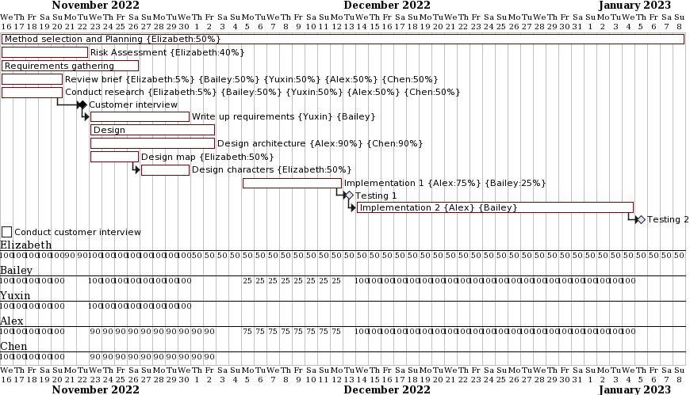
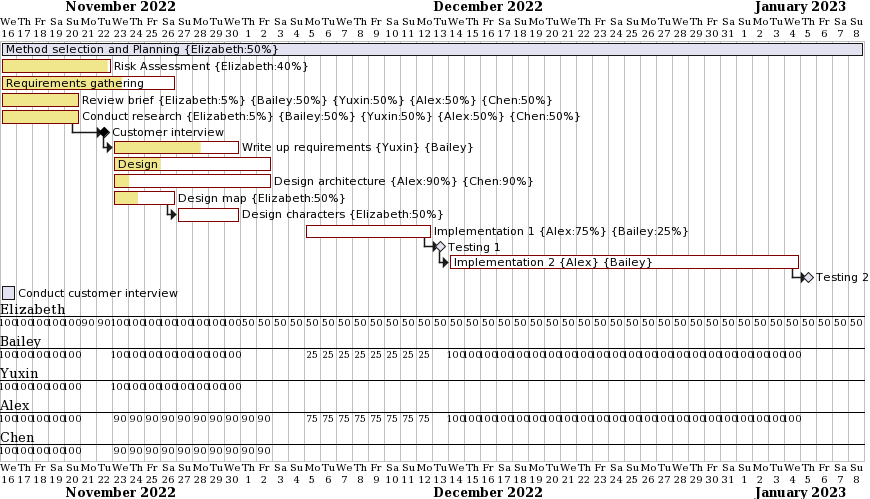
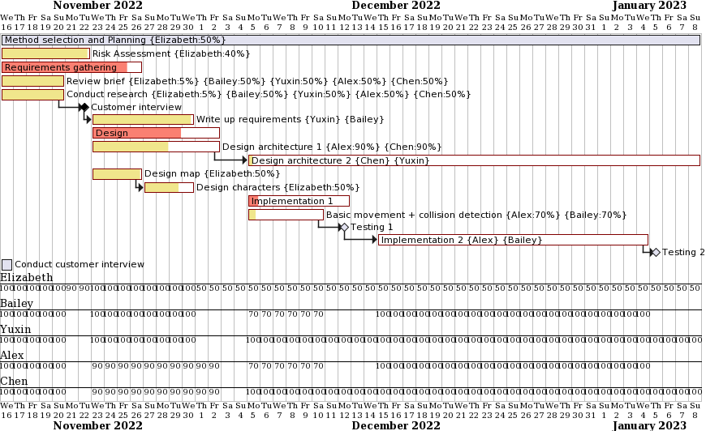
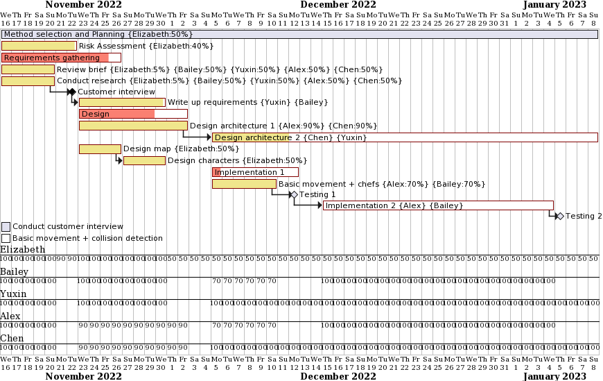
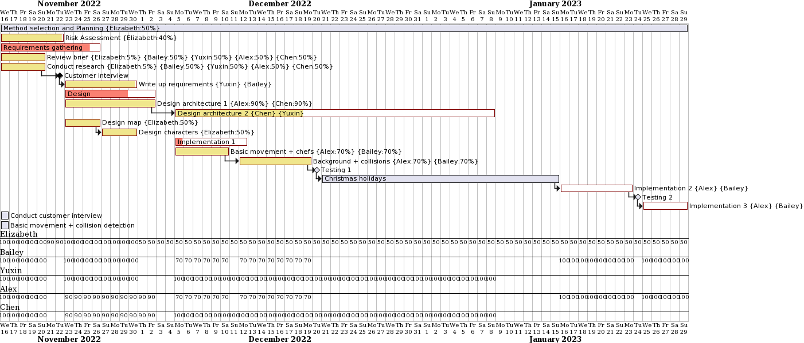
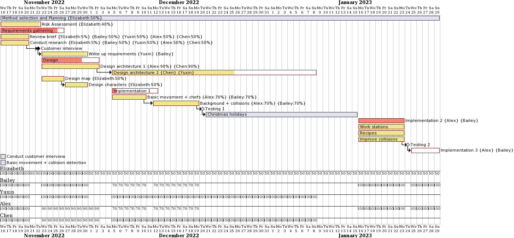
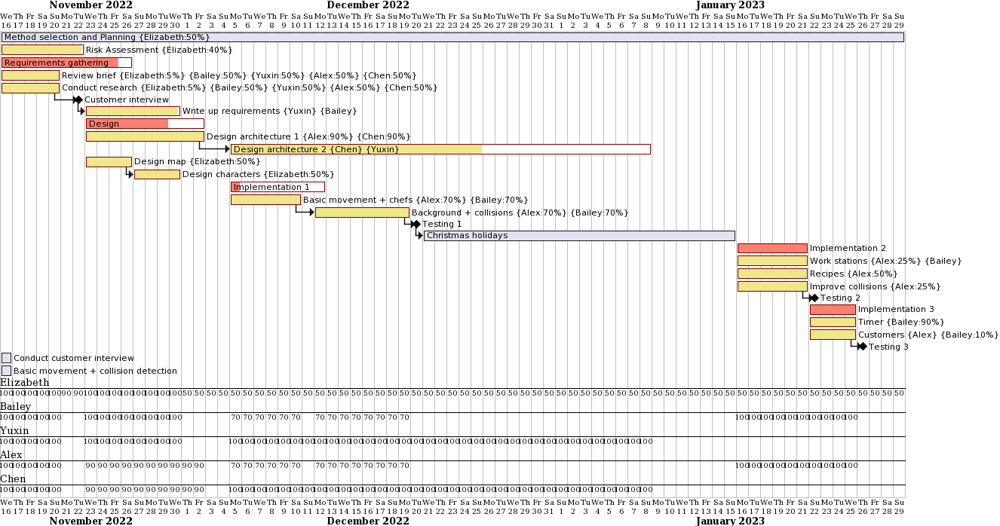
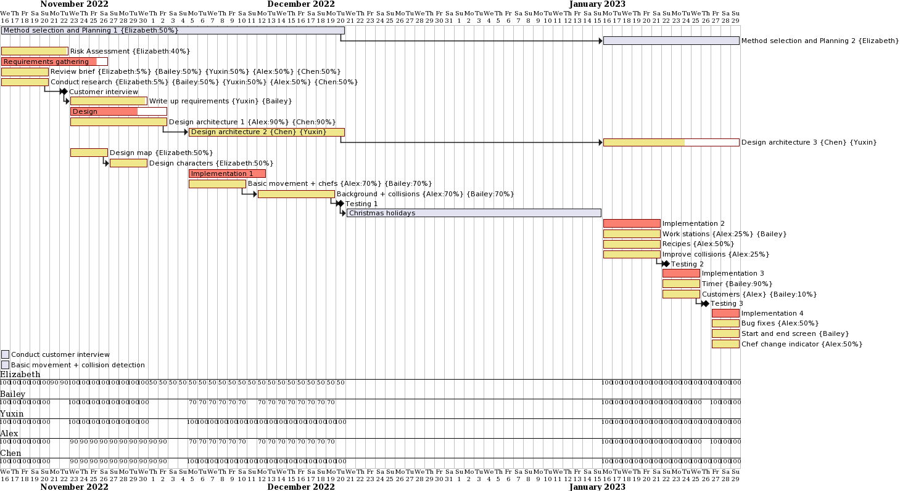

  

  <h1 align="center">Piazza Panic</h1>

  

     
    <a href="https://github.com/GourdoRamsay/GourdoRamsay.github.io">Team 20 Home</a>
    <a href="TEAM13README"><strong>Team 13 Home</strong></a>
  

<h3 align="center">Week 1</h3>

  

<h3 align="center">Week 2</h3>

  

<h3 align="center">Week 3</h3>

  

<h3 align="center">Week 4</h3>

  

<h3 align="center">Week 5</h3>

  

<h3 align="center">Week 9</h3>

  

<h3 align="center">Week 10 (1)</h3>

  

<h3 align="center">Week 10 (2)</h3>

  

<h3 align="center">Week 10 (3)</h3>

  

  

     
    <a href="https://github.com/GourdoRamsay/GourdoRamsay.github.io">Home</a>
    <a href="TEAM13README"><strong>Team 13 Home</strong></a>
  

