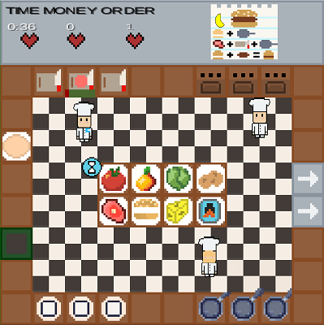

  

  <h1 align="center">Piazza Panic</h1>

  

    A LibGDX game for ENG1. This project is a continuation of Team 13's work on the creation of Piazza Panic.
    Below you will find the documentation and source code for Team 13's work and Team 20's work.
     
    <a href="https://github.com/CrimsonLeaves/ENG1-Team20-Assessment2"><strong>Team 20 GitHub Repo</strong></a> 
     
     
    <a href="https://github.com/GourdoRamsay/GourdoRamsay.github.io"><strong>Team 20 GitHubIO Website</strong></a>
  

<h3 align="center">Assessment Framework</h3>

  <a href="./files/assessmentDocuments/brief.md"><strong>Briefing</strong></a>
  •
  <a href="./files/assessmentDocuments/eng1-team-assessment-1.pdf"><strong>Structure</strong></a>

<h3 align="center">Team 13 Documentation</h3>

  <a href="https://github.com/GourdoRamsay/GourdoRamsay.github.io/blob/main/TEAM13README.md"><strong>Team 13</strong></a>

<h1 align="center">Team 20 Project</h1>
<h3 align="center">Project Repository</h3>

  <a href="https://github.com/CrimsonLeaves/ENG1-Team20-Assessment2"><strong>ENG1-Team20-Assessment2</strong></a>

<h3 align="center">Website Repository</h3>

  <a href="https://github.com/GourdoRamsay/GourdoRamsay.github.io"><strong>GourdoRamsay.github.io</strong></a>

<h3 align="center">Requirements</h3>

 <!-- <a href="./files/assessment/Requirements v2.pdf"><strong>Requirements v2</strong></a> TODO-->

<h3 align="center">Architecture</h3>

  <a href="https://github.com/GourdoRamsay/GourdoRamsay.github.io/blob/main/files/team20/stateDiagram.jpg"><strong> State Diagram </strong></a>

<h3 align="center">Method Selection and Planning</h3>

  <a href="https://github.com/GourdoRamsay/GourdoRamsay.github.io/blob/main/files/team20/msapTeam20.pdf"><strong> Method Selection and Planning </strong></a>

<h3 align="center">Risk Assessment and Mitigation</h3>

  <!--<a href="./files/assessment/Risk Assessment and Mitigation v2.pdf"><strong>Risk Assessment and Mitigation</strong></a> TODO-->

<h3 align="center">Implementation</h3>

  <!--<a href="./files/assessment/Piazza Panic.jar" download><strong> Piazza Panic.jar </strong></a> TODO-->
  <!--• DO NOT REMOVE, USED AS SPACER-->
  <!--<a href="./files/assessment/piazza-panic-main (1).zip" download><strong> Implementation Part A </strong></a> TODO-->
  <!--• DO NOT REMOVE, USED AS SPACER-->
  <!--<a href="./files/assessment/Implementation Part B.pdf"><strong> Implementation Part B </strong></a> TODO-->

<h3 align="center">Team 13 Documentation</h3>

  <a href="https://github.com/GourdoRamsay/GourdoRamsay.github.io/blob/main/TEAM13README.md"><strong>Team 13</strong></a>

