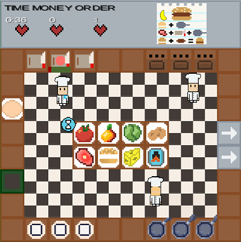

  

  <h1 align="center">Piazza Panic</h1>

  

    A LibGDX game for ENG1
     
    <a href="https://github.com/CrimsonLeaves/ENG1-Team20-Assessment2"><strong>Game GitHub Repo»</strong></a> 
     
     
    <a href="https://github.com/GourdoRamsay/GourdoRamsay.github.io">GitHubIO Website</a>
  

<h3 align="center">Assessment Framework</h3>

  <a href="./files/info/brief.md"><strong> brief.md </strong></a>
  •
  <a href="./files/info/eng1-team-assessment-1.pdf"><strong> assessment.pdf </strong></a>

<h1 align="center">Our Project</h1>

<h3 align="center">Project Repository</h3>

  <a href="https://github.com/CrimsonLeaves/ENG1-Team20-Assessment2"><strong>ENG1-Team20-Assessment2</strong></a>

<h3 align="center">Website Repository</h3>

  <a href="https://github.com/GourdoRamsay/GourdoRamsay.github.io"><strong>GourdoRamsay.github.io</strong></a>

<h3 align="center">Requirements</h3>

 <!-- <a href="./files/assessment/Requirements v2.pdf"><strong>Requirements v2</strong></a> TODO-->

<h3 align="center">Architecture</h3>

  <!-- <a href="./files/assessment/Architecture V2.pdf"><strong> Architecture v2 </strong></a> TODO-->

<h3 align="center">Method Selection and Planning</h3>

  <!--<a href="./files/assessment/Method Selection and Planning.pdf"><strong> Method Selection and Planning </strong></a> TODO-->

<h3 align="center">Risk Assessment and Mitigation</h3>

  <!--<a href="./files/assessment/Risk Assessment and Mitigation v2.pdf"><strong>Risk Assessment and Mitigation</strong></a> TODO-->

<h3 align="center">Implementation</h3>

  <!--<a href="./files/assessment/Piazza Panic.jar" download><strong> Piazza Panic.jar </strong></a> TODO-->
  •
  <!--<a href="./files/assessment/piazza-panic-main (1).zip" download><strong> Implementation Part A </strong></a> TODO-->
  •
  <!--<a href="./files/assessment/Implementation Part B.pdf"><strong> Implementation Part B </strong></a> TODO-->

