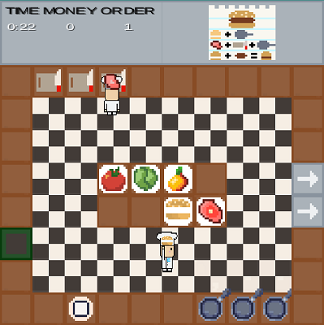

  

  <h1 align="center">Piazza Panic</h1>

  

    A LibGDX game for ENG1
     
    <a href="https://github.com/team13eng1/piazza-panic"><strong>Team 13 GitHub Repo</strong></a>
     
     
    <a href="https://github.com/GourdoRamsay/GourdoRamsay.github.io/blob/Team20WebsiteIO/TEAM13README.md"><strong>Team 13 GitHubIO Website</strong></a>
  

<h3 align="center">Assessment Framework</h3>

  <a href="./files/team13/assessmentDocuments/brief.md"><strong> brief.md </strong></a>
  •
  <a href="./files/team13/assessmentDocuments/eng1-team-assessment-1.pdf"><strong> assessment.pdf </strong></a>

<h3 align="center">Team 20 Documentation</h3>

  <a href="https://github.com/GourdoRamsay/GourdoRamsay.github.io/blob/Team20WebsiteIO/README.md"><strong>Team 20</strong></a>

<h1 align="center">Team 13 Project</h1>
<h3 align="center">Project Repository</h3>

  <a href="https://github.com/team13eng1/piazza-panic"><strong>piazza-panic</strong></a>

<h3 align="center">Website Repository</h3>

  <a href="https://github.com/GourdoRamsay/GourdoRamsay.github.io/blob/Team20WebsiteIO/TEAM13README.md"><strong>Team 13</strong></a>

<h3 align="center">Requirements</h3>

  <a href="./files/team13/documents/Requirements_v2.pdf"><strong>Requirements v2</strong></a>

<h3 align="center">Architecture</h3>

  <a href="./files/team13/documents/Architecture_V2.pdf"><strong> Architecture v2 </strong></a>
  •
  <a href="./files/team13/documents/Sequence_Diagram_v1.pdf"><strong> Sequence Diagram v1 </strong></a>
  •
  <a href="./files/team13/documents/Sequence_Diagram_v2.pdf"><strong> Sequence Diagram v2 </strong></a>
  •
  <a href="./files/team13/documents/Sequence_Diagram_v3.pdf"><strong> Sequence Diagram v3 </strong></a>
  •
  <a href="./files/team13/documents/State_Diagram_v1.pdf"><strong> State Diagram v1 </strong></a>
  •
  <a href="./files/team13/documents/State_Diagram_v2.pdf"><strong> State Diagram v2 </strong></a>
  •
  <a href="./files/team13/documents/Use-Case_Diagram_v1.pdf"><strong> Use Case Diagram v1 </strong></a>
  •
  <a href="./files/team13/documents/Use-Case_Diagram_v2.pdf"><strong> Use Case Diagram v2 </strong></a>
  •
  <a href="./files/team13/documents/Component_diagram_v1.pdf"><strong> Component Diagram v1 </strong></a>
  •
  <a href="./files/team13/documents/Component_diagram_v2.pdf"><strong> Component Diagram v2 </strong></a>
  •
  <a href="./files/team13/documents/All_attributes_in_chef.pdf"><strong> All Attributes in chef </strong></a>
  •
  <a href="./files/team13/documents/All_attributes_in_playScreen.pdf"><strong> All Attributes in playScreen </strong></a>
  •
  <a href="./files/team13/documents/Chef_Class_Diagram.pdf"><strong> Chef Class Diagram </strong></a>
  •
  <a href="./files/team13/documents/Order_Class_Diagram.pdf"><strong> Order Class Diagram </strong></a>
  •
  <a href="./files/team13/documents/Ingredients_Class_Diagram.pdf"><strong> Ingredients Class Diagram </strong></a>
  •
  <a href="./files/team13/documents/HUD_Class_Diagram.pdf"><strong> HUD Class Diagram </strong></a>
  •
  <a href="./files/team13/documents/Sprites_Class_Diagram.pdf"><strong> Sprites Class Diagram </strong></a>

<h3 align="center">Method Selection and Planning</h3>

  <a href="./files/team13/documents/Method_Selection_and_Planning.pdf"><strong> Method Selection and Planning </strong></a>
  •
  <a href="https://github.com/GourdoRamsay/GourdoRamsay.github.io/blob/Team20WebsiteIO/GANTT.md"><strong> Gantt Charts </strong></a>

<h3 align="center">Risk Assessment and Mitigation</h3>

  <a href="./files/team13/documents/Risk_Assessment_and_Mitigation_v2.pdf"><strong>Risk Assessment and Mitigation</strong></a>

<h3 align="center">Implementation</h3>

  <a href="./files/team13/game/Piazza Panic.jar" download><strong> Piazza Panic.jar </strong></a>
  •
  <a href="./files/team13/game/piazza-panic-main (1).zip" download><strong> Implementation Part A </strong></a>
  •
  <a href="./files/team13/documents/Implementation_Part_B.pdf"><strong> Implementation Part B </strong></a>

<h3 align="center">Team 20 Documentation</h3>

  <a href="https://github.com/GourdoRamsay/GourdoRamsay.github.io/blob/Team20WebsiteIO/README.md"><strong>Team 20</strong></a>

